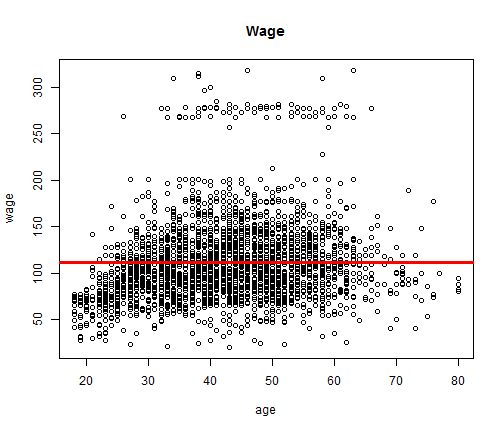
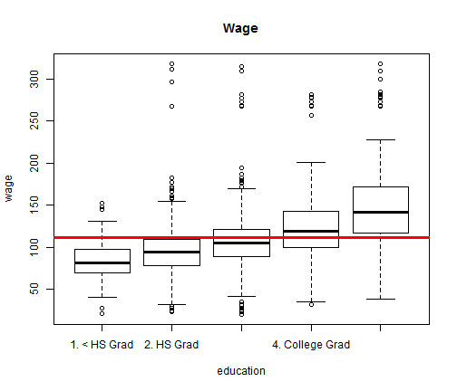
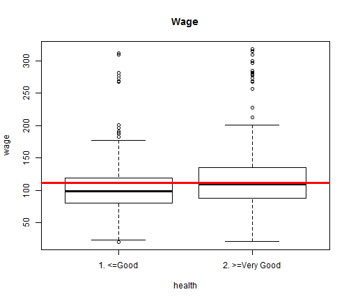

## Presentation

From Mid-Atlantic Wage data set (containing wage and other data for a group of 3000 male workers in the Mid-Atlantic region) I build a simple application with Shiny that allows to chose the variable to match with the wage and show the related plot.  

For every plot, flagging the voice on the left, it's possible to show a red line indicating the level of the calculated average wage.

---

## Libraries and data sets


```r
library(ISLR)
data(Wage)

choices <- c("year", "age", "sex", "maritl", "race", "education", "job class", 
    "health")
mw <- mean(Wage$wage)
md <- median(Wage$wage)
par(cex.axis = 0.7)
```


---

## Plot (wage vs age)

```r
plot(Wage[, choices[2]], Wage$wage, xlab = choices[2], ylab = "wage", main = "Wage")
lines(c(0, 100), c(mw, mw), col = "red", lwd = 3)
```

 

```r
width = 50
```


---

## Plot (wage vs education)

```r
plot(Wage[, choices[6]], Wage$wage, xlab = choices[6], ylab = "wage", main = "Wage")
lines(c(0, 100), c(mw, mw), col = "red", lwd = 3)
```

 


---

## Plot (wage vs job class)

```r
plot(Wage[, choices[8]], Wage$wage, xlab = choices[8], ylab = "wage", main = "Wage")
lines(c(0, 100), c(mw, mw), col = "red", lwd = 3)
```

 


